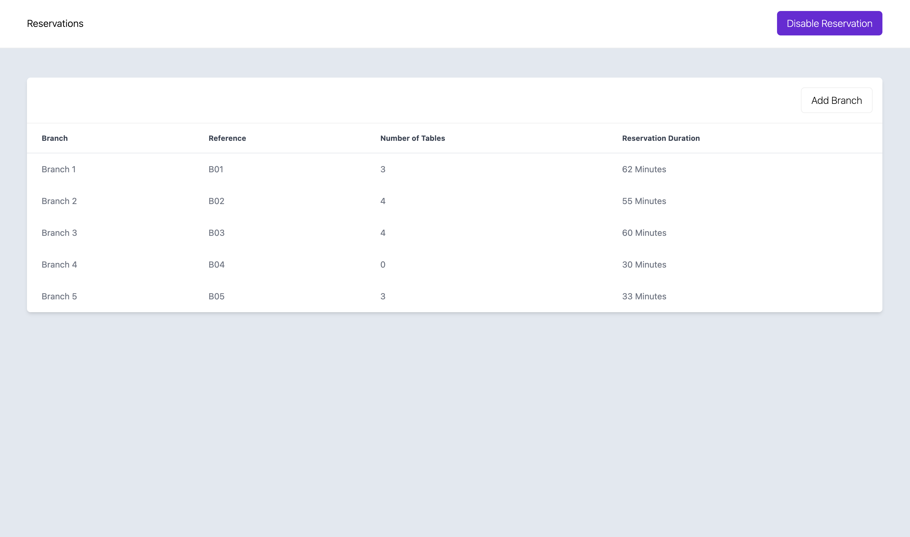

# [Restaurant-Reservation-System]() 👨🏻‍🍳 

<h1 align="center">Main Page</h1>

<h1 align="center">Edit Branch Popup</h1>

<h1 align="center">Add Branch Popup</h1>

## Here's what I put into my consideration. 🧠

## 1. Structure (I used the following structure in my code). 🧹

- `src`
  - `components`
    - `layout`
      - Main Navbar
    - `shared`
      - Basic Input
      - Basic Modal
      - Dynamic Button
      - Inline Loader
      - Select Input
      - Time Slots Input
    - Add Branch
    - Branches Table
    - Edit Branch
  - `core`
    - `constants`
    - `interceptors`
    - `services`
    - `utils`
  - `store`
    - branches
  - `views`
    - Manage Reservation Page

## 2. Style 🎨 & Packages ⚙️

* Styling: Tailwind CSS.
* Packages: `axios` for HTTP calls & `vuex` for state management.

## 3. Git & CICD ⚡

* For Keeping my development history intact and in multiple commits: `50` commit.
* I used `Automatic CICD` offered by `Vercel`. 🌐